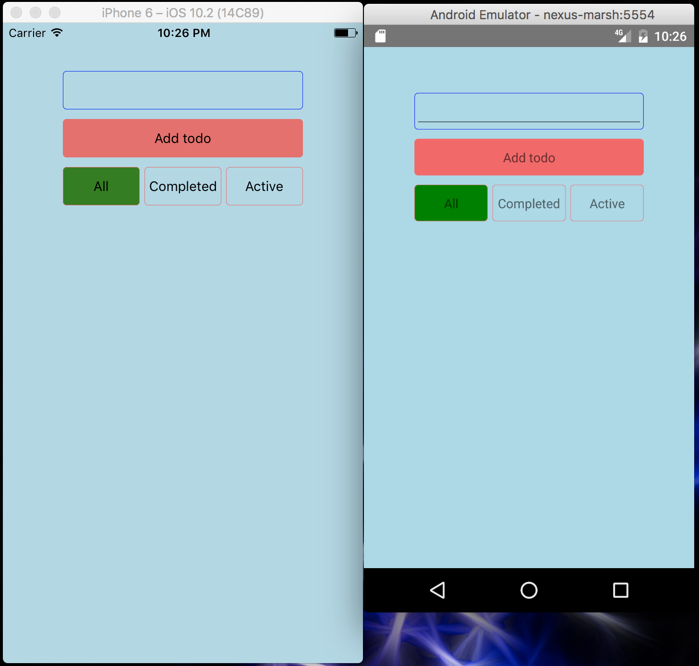
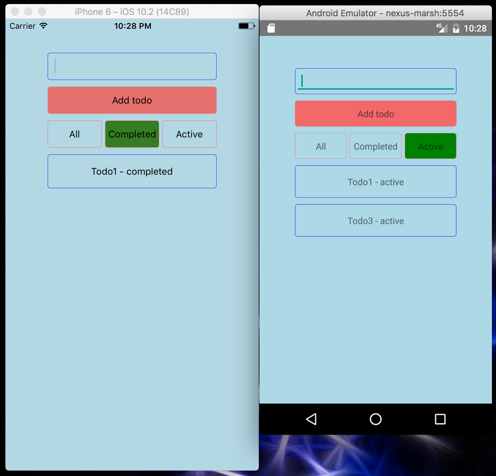
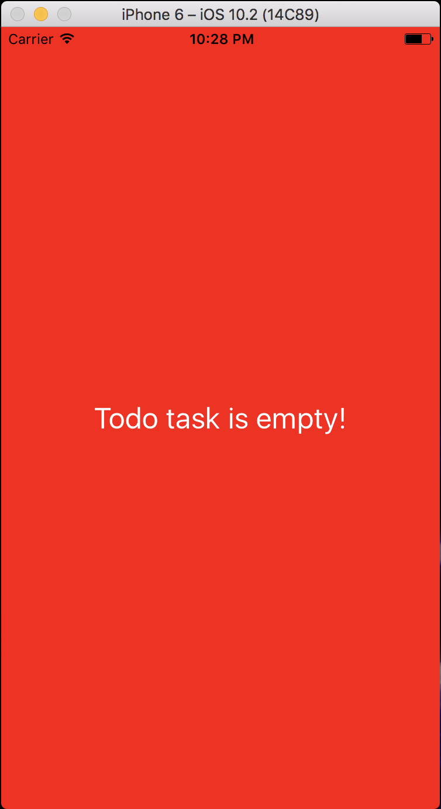
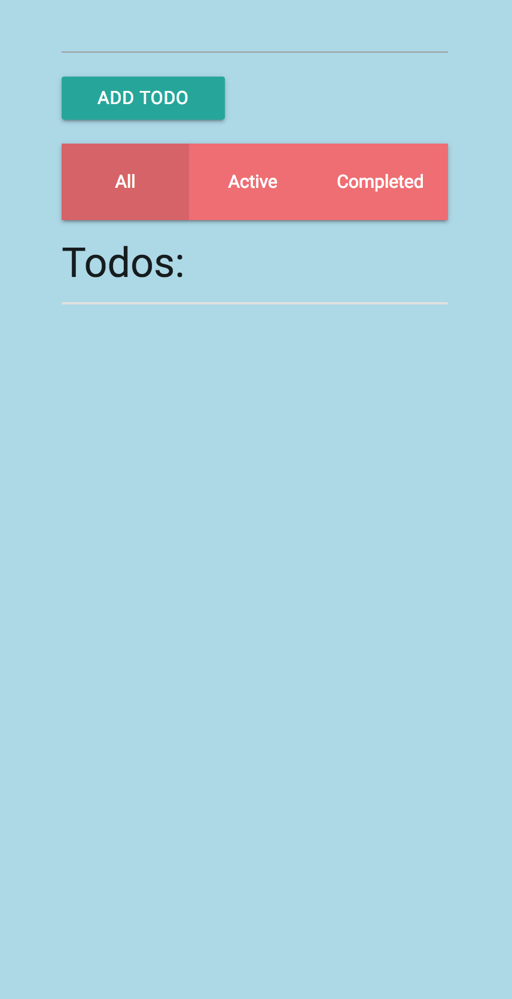
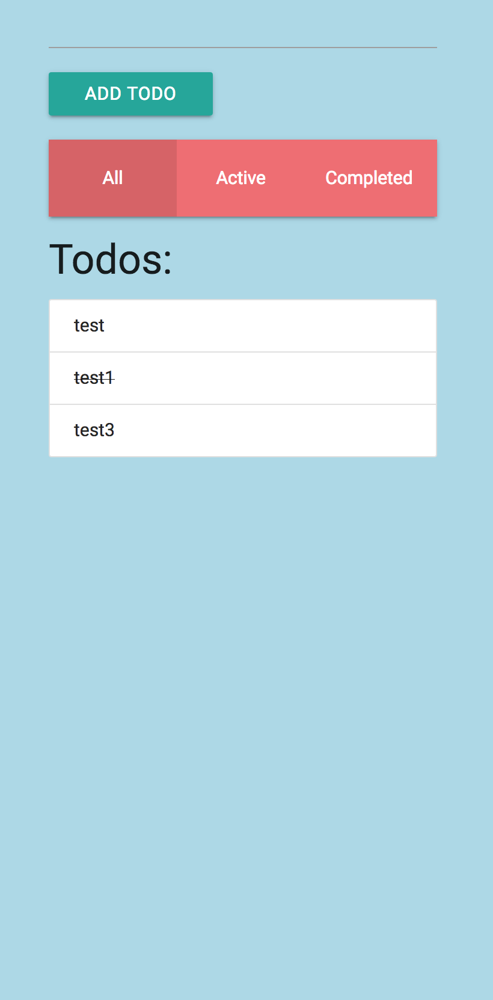
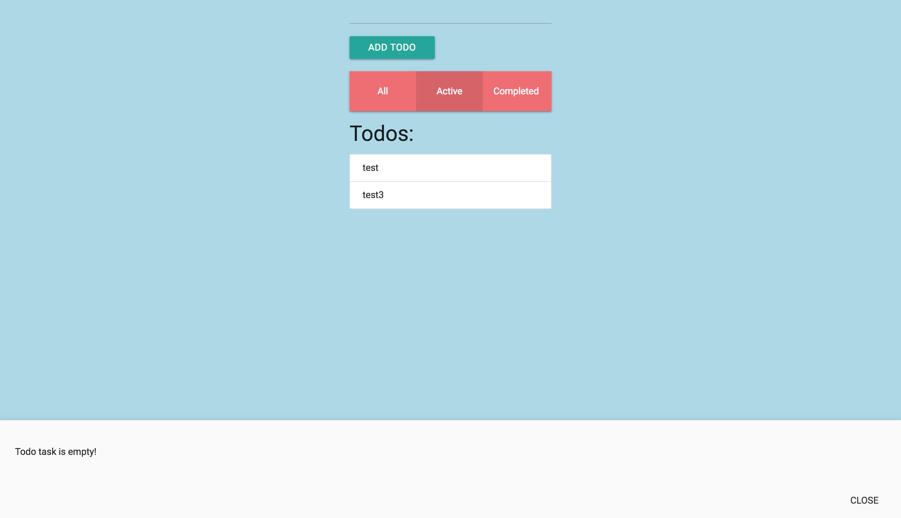

# React & React Native cross platform app with Redux

## About
This is cross platfom app build with [react@15.4.0-rc.4](https://facebook.github.io/react/) and [react-native@0.40.0](https://facebook.github.io/react-native/) with [redux@3.6.0](http://redux.js.org/) for data management. This is version of project setup in which most of redux code is shared.
You can add todos, toggle them and change layout to see all, completed or active todos.

### Shared code
Mobile and web app share most of Redux code like store config, actions and reducers. That code is in 'app' folder.

### Mobile 
Code for mobile, such as containers and components, is in 'mobile' folder.





### Web 
[react-router@3.0.1](https://github.com/ReactTraining/react-router) is used for navigating between todos. Code for web app is in 'web' folder.





## Instalation 
App is built with yarn, but you can run it with npm:

1. Clone repository
2. ``` yarn ``` or ``` npm install ``` to build project
3. Run project:
 - ``` yarn run ios ``` to run ios app
 - ```yarn run android ``` to run android app
 - ```yarn run web ``` to run web app

If you don't have React Native setup on your machine, you can take a look at [official setup](https://facebook.github.io/react-native/docs/getting-started.html) by Facebook 
